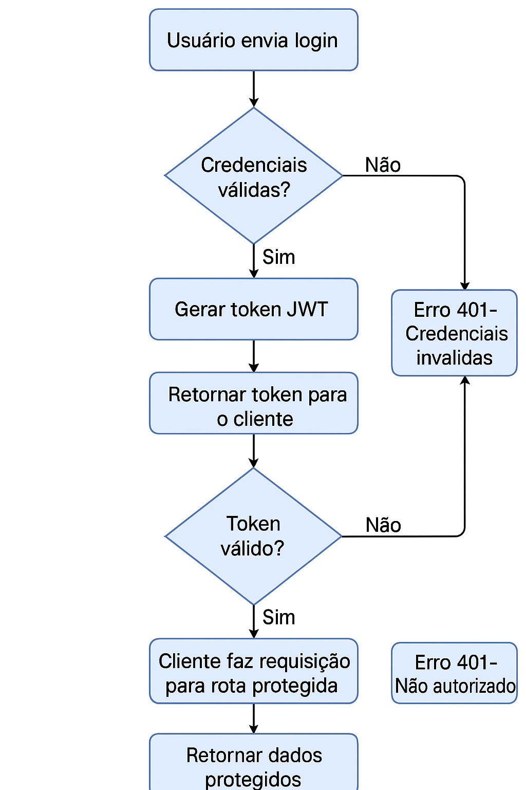
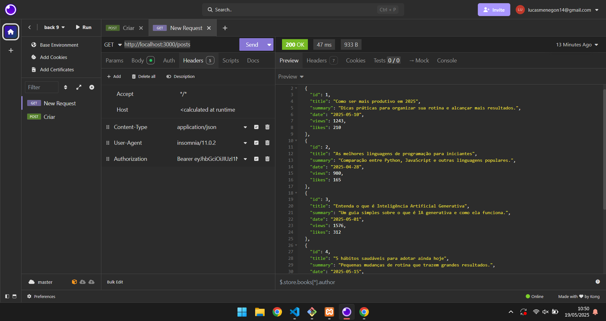

# 🔐 3DES Login Auth 2025

Sistema simples de autenticação com **JWT**, rotas protegidas e estrutura clara para testes via ferramentas como **Insomnia** ou **Postman**.


## Atividade solicitada

- [ ] Testar backend com Insomnia.
- [x] Estudar e documentar estrutura do projeto.
- [x] Detalhar e documentar bibliotecas utilizadas.
- [x] Documentar descrição do funcionamento.
- [x] Desenhar fluxo de informação (diagrama de atividades).
---

## 🚀 Atividades Desenvolvidas

- ✅ Testes da API com Insomnia.
- 📁 Estudo e documentação da estrutura do projeto.
- 🧩 Mapeamento e explicação das dependências.
- 🔄 Descrição do fluxo de funcionamento da autenticação.
- 🧠 Diagrama de atividades representando o fluxo de login e acesso.

---

## 🗂️ Estrutura do Projeto


```markdown
api/
├── .env                # Variáveis de ambiente (ex: chave JWT)
├── package.json        # Scripts e dependências do projeto
├── server.js           # Entry point da API (Express)
└── src/
    ├── controllers/    # Lógica dos endpoints
    │   ├── login.js    # Controller de autenticação
    │   └── posts.js    # Controller dos posts protegidos
    ├── data/
    │   └── posts.js    # Dados mockados dos posts
    ├── middlewares/
    │   └── auth.js     # Middleware para validação do JWT
    └── routes/
        ├── login.js    # Rotas públicas (login)
        └── posts.js    # Rotas privadas (protegidas por token)
```


## 📦 Bibliotecas Utilizadas

| Biblioteca       | Descrição                                                        |
|------------------|------------------------------------------------------------------|
| **express**      | Framework para criação de APIs REST                             |
| **dotenv**       | Carrega variáveis de ambiente do arquivo `.env`                 |
| **jsonwebtoken** | Geração e validação de tokens JWT para autenticação segura      |

---

## 🔄 Funcionamento da API

### 🔐 1. Login
- **Endpoint**: `POST /login`
- **Requisição**:
  ```json
  {
    "user": "usuario@gmail.com",
    "psw": "a1b2@b3c4"
  }

### 🔒 2. Acesso a Rota Protegida



### Testes
